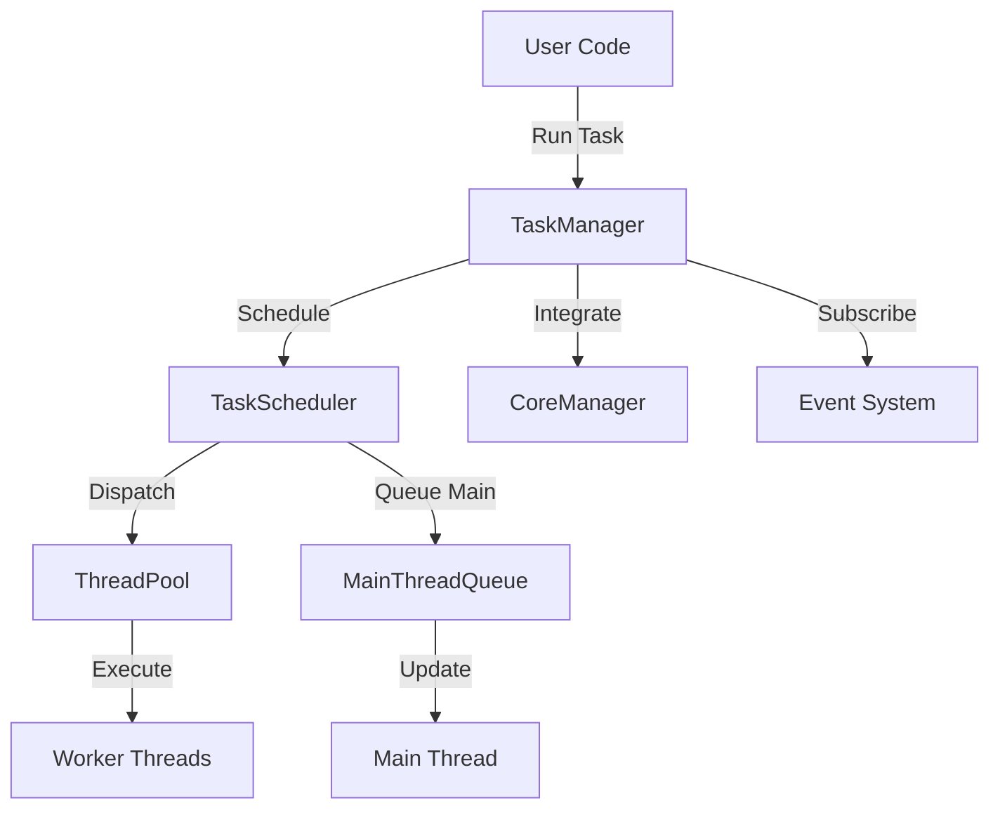
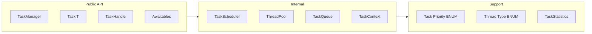

# Реализация TaskSystem для BagiEngine

## Общая архитектура

TaskSystem будет новым модулем в `src/Modules/TaskSystem/`, использующим C++20 корутины для асинхронного выполнения задач с многопоточной поддержкой.

### Архитектура модуля



### Компонентная структура



## Структура файлов

### Основная структура модуля

```
src/Modules/TaskSystem/
├── CMakeLists.txt
└── src/
    └── TaskSystem/
        ├── TaskManager.h
        ├── TaskManager.cpp
        ├── Task.h
        ├── TaskHandle.h
        ├── TaskScheduler.h
        ├── TaskScheduler.cpp
        ├── ThreadPool.h
        ├── ThreadPool.cpp
        ├── TaskQueue.h
        ├── TaskQueue.cpp
        ├── TaskContext.h
        ├── TaskPriority.h
        ├── Awaitables.h
        ├── Awaitables.cpp
        ├── TaskGroup.h
        ├── TaskGroup.cpp
        ├── TaskStatistics.h
        └── CancellationToken.h
```

## Ключевые компоненты

### 1. TaskManager (Singleton, главный интерфейс)

**Файл:** `src/Modules/TaskSystem/src/TaskSystem/TaskManager.h`

Публичный API для пользователя:
- `Run(Task<T>, priority)` - запуск задачи
- `RunDelayed(Task<T>, delay)` - отложенный запуск
- `RunRepeating(Task<T>, interval)` - повторяющаяся задача
- `WhenAll(tasks...)` - ожидание всех задач
- `WhenAny(tasks...)` - ожидание любой задачи
- `CreateGroup()` - создание группы задач
- `SwitchToMainThread()` - awaitable для главного потока
- `SwitchToBackground()` - awaitable для фонового потока

**Интеграция:**
- Наследуется от `SingletonAtomic<TaskManager>`
- Использует `PassKey<CoreManager>` для lifecycle методов
- Интегрируется с `EventsProviderManager` для awaitable событий

### 2. Task<T> (C++20 корутина)

**Файл:** `src/Modules/TaskSystem/src/TaskSystem/Task.h`

Основной тип корутины с поддержкой:
- `promise_type` для C++20 корутин
- `co_await`, `co_return`, `co_yield`
- Возвращаемые значения `Task<T>` или `Task<void>`
- Обработка исключений через `std::exception_ptr`
- Awaitable interface для композиции задач

### 3. TaskScheduler (Планировщик)

**Файл:** `src/Modules/TaskSystem/src/TaskSystem/TaskScheduler.h`

Внутренняя логика планирования:
- Приоритетные очереди для разных `TaskPriority`
- Delayed tasks с временными метками
- Repeating tasks с интервалами
- Main thread queue (обрабатывается в `Update()`)
- Распределение задач по потокам

### 4. ThreadPool (Пул потоков)

**Файл:** `src/Modules/TaskSystem/src/TaskSystem/ThreadPool.h`

Управление рабочими потоками:
- Автоматическое определение количества потоков (`std::thread::hardware_concurrency()`)
- Lock-free очереди задач (используя `std::atomic`)
- Work stealing для балансировки нагрузки
- Graceful shutdown с ожиданием завершения задач

### 5. Awaitables (Примитивы синхронизации)

**Файл:** `src/Modules/TaskSystem/src/TaskSystem/Awaitables.h`

Готовые awaitable объекты:
- `MainThreadAwaiter` - переключение на главный поток
- `BackgroundAwaiter` - переключение на фоновый поток
- `ThreadAwaiter` - переключение на конкретный тип потока
- `DelayAwaiter` - задержка на время
- `FrameDelayAwaiter` - задержка на кадры
- `EventAwaiter<Event>` - ожидание события
- `ConditionAwaiter` - ожидание условия

### 6. TaskPriority и ThreadType (Enums)

**Файл:** `src/Modules/TaskSystem/src/TaskSystem/TaskPriority.h`

```cpp
CORE_ENUM(TaskPriority, Low, Normal, High, Critical);
CORE_ENUM(ThreadType, MainThread, Background, IO, Custom);
```

### 7. TaskGroup (Группировка задач)

**Файл:** `src/Modules/TaskSystem/src/TaskSystem/TaskGroup.h`

Управление группами задач:
- Запуск нескольких задач в группе
- Массовая отмена `CancelAll()`
- Ожидание завершения группы `WaitAll()`
- Статистика по группе

### 8. CancellationToken (Отмена задач)

**Файл:** `src/Modules/TaskSystem/src/TaskSystem/CancellationToken.h`

Кооперативная отмена задач:
- `IsCancelled()` - проверка отмены
- `ThrowIfCancelled()` - бросает исключение
- Интеграция с `Task<T>` для автоматической проверки

### 9. TaskStatistics (Профилирование)

**Файл:** `src/Modules/TaskSystem/src/TaskSystem/TaskStatistics.h`

Сбор метрик:
- Количество выполненных задач
- Среднее время выполнения
- Загрузка потоков
- Очередь задач (pending count)

## Интеграция с движком

### Изменения в CoreManager

**Файл:** [`src/Modules/BECore/GameManager/CoreManager.h`](src/Modules/BECore/GameManager/CoreManager.h)

Добавить:
```cpp
#include <TaskSystem/TaskManager.h>

class CoreManager : public Singleton<CoreManager> {
public:
    static TaskManager& GetTaskManager() {
        return GetInstance()._taskManager;
    }

private:
    TaskManager _taskManager;
};
```

**Файл:** `src/Modules/BECore/GameManager/CoreManager.cpp`

В методах lifecycle:
```cpp
void CoreManager::OnApplicationInit(PassKey<Application>) {
    // ... существующий код ...
    _taskManager.Initialize(PassKey<CoreManager>{});
}

void CoreManager::OnGameCycle(PassKey<Application>) const {
    // ... существующий код ...
    _taskManager.Update(PassKey<CoreManager>{}); // Обработка main thread задач
}

void CoreManager::OnApplicationDeinit(PassKey<Application>) {
    _taskManager.Shutdown(PassKey<CoreManager>{});
    // ... существующий код ...
}
```

### CMakeLists.txt для модуля

**Файл:** `src/Modules/TaskSystem/CMakeLists.txt`

Структура аналогична [`src/Modules/Events/CMakeLists.txt`](src/Modules/Events/CMakeLists.txt):
- Статическая библиотека `TaskSystemModule`
- Зависимость от `BECoreModule` и `EventsModule`
- Переиспользование PCH от BECore (`REUSE_FROM BECoreModule`)
- Force Include для `BECore/pch.h`

### Cursor Rules

**Файл:** `.cursor/rules/tasksystem-module.mdc`

Создать правила для работы с TaskSystem:
- Паттерны использования корутин
- Примеры awaitable объектов
- Best practices для многопоточности
- Интеграция с Events

## Примеры использования

### Пример 1: Асинхронная загрузка ресурса

```cpp
Task<void> LoadTextureAsync(PoolString path) {
    LOG_INFO("Loading texture: {}", path);
    
    // Переключаемся на фоновый поток
    co_await TaskManager::SwitchToBackground();
    
    // Загружаем файл (blocking I/O)
    auto data = FileSystem::GetInstance().LoadFile(path);
    
    // Возвращаемся в главный поток для создания GPU ресурса
    co_await TaskManager::SwitchToMainThread();
    
    // Создаем текстуру (требует OpenGL context)
    CreateGPUTexture(data);
    
    LOG_INFO("Texture loaded: {}", path);
}

// Использование:
TaskManager::GetInstance().Run(LoadTextureAsync("assets/player.png"));
```

### Пример 2: Параллельная обработка

```cpp
Task<void> ProcessEntities(eastl::vector<Entity> entities) {
    eastl::vector<TaskHandle<void>> tasks;
    
    // Запускаем обработку каждой entity параллельно
    for (auto& entity : entities) {
        tasks.push_back(TaskManager::Run(ProcessEntity(entity)));
    }
    
    // Ждем завершения всех задач
    co_await TaskManager::WhenAll(tasks);
    
    LOG_INFO("All entities processed");
}
```

### Пример 3: Геймплейная последовательность

```cpp
Task<void> CharacterAttackSequence() {
    PlayAnimation("windup");
    co_await Delay(200ms);
    
    DealDamage();
    PlayAnimation("hit");
    co_await Delay(300ms);
    
    PlayAnimation("recovery");
    co_await Delay(400ms);
}
```

### Пример 4: Ожидание события

```cpp
Task<void> WaitForUserInput() {
    LOG_INFO("Waiting for key press...");
    
    auto event = co_await WaitForEvent<KeyPressEvent>();
    
    LOG_INFO("Key pressed: {}", event.key);
}
```

### Пример 5: Task Group с отменой

```cpp
void StartAIUpdates() {
    auto aiGroup = TaskManager::CreateGroup();
    
    for (auto& npc : npcs) {
        aiGroup.Run(UpdateNPCLoop(npc));
    }
    
    // Позже можно отменить все AI задачи
    aiGroup.CancelAll();
}

Task<void> UpdateNPCLoop(NPC& npc) {
    while (!npc.GetCancellationToken().IsCancelled()) {
        UpdateNPCAI(npc);
        co_await Delay(100ms);
    }
}
```

## Технические детали

### Потокобезопасность

- `TaskManager` использует `SingletonAtomic` для thread-safe инициализации
- `TaskScheduler` использует lock-free очереди где возможно
- `ThreadPool` имеет per-thread очереди с work stealing
- Main thread queue защищена mutex'ом (используется редко, только в `Update()`)

### Управление памятью

- `Task<T>` использует `std::coroutine_handle` (RAII)
- `TaskHandle<T>` использует `IntrusivePtr` для подсчета ссылок
- EASTL контейнеры (`eastl::vector`, `eastl::queue`) для задач

### Обработка ошибок

- Исключения в корутинах сохраняются в `promise_type::_exception`
- При `co_await` или `GetResult()` исключение перебрасывается
- `CancellationToken` бросает `TaskCancelledException` через `ThrowIfCancelled()`
- Все ошибки логируются через `LoggerManager`

### Производительность

- Lock-free операции где возможно
- Work stealing в ThreadPool для балансировки
- Минимальное количество аллокаций (pool allocators для задач)
- Отложенная инициализация потоков (lazy initialization)

## Зависимости

- **BECoreModule**: Singleton, PassKey, Logger, Assert
- **EventsModule**: EventBase, EventsProviderManager (для awaitable событий)
- **Стандартная библиотека**: `<coroutine>`, `<thread>`, `<atomic>`, `<mutex>`
- **EASTL**: контейнеры и smart pointers

## Тестирование

Создать тесты в существующей системе тестирования:
- `TaskSystemBasicTests` - запуск, ожидание, результаты
- `TaskSystemThreadingTests` - переключение потоков, параллелизм
- `TaskSystemDelayTests` - delayed и repeating tasks
- `TaskSystemCancellationTests` - отмена задач и групп
- `TaskSystemEventTests` - интеграция с событиями
- `TaskSystemStressTests` - нагрузочное тестирование

## Документация

Добавить в проект:
- `docs/TaskSystem.md` - полное руководство пользователя
- Обновить `.cursor/rules/tasksystem-module.mdc`
- Добавить примеры в `examples/TaskSystemExamples/`
- Обновить главный README с описанием TaskSystem
