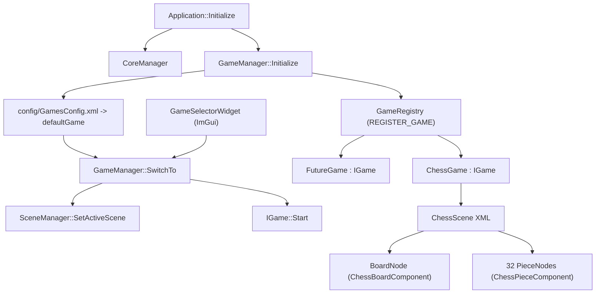

# Chess MVP + Games Infrastructure

Закладываем базовую инфраструктуру под много игр (`src/Modules/Games`: `IGame`, `GameManager`, реестр, переключение через ImGui-виджет и `config/GamesConfig.xml`), а шахматный MVP делаем первой реализацией поверх неё.

## Архитектура



Слои:
- **Games (база)** — общий контракт игры, реестр, активная игра, переключение, конфиг.
- **Chess (конкретика)** — чистая модель + сценочные компоненты + регистрация в реестре.
- **Сцены** — каждая игра выбирает свою сцену по имени; `SceneManager` теперь умеет переключаться.

## 1. Базовый модуль `src/Modules/Games`

Структура (по образцу [src/Modules/Events](src/Modules/Events)):

- `src/Modules/Games/CMakeLists.txt` — `add_library(GamesModule STATIC ...)`, `REUSE_FROM BECoreModule` PCH, force-include `BECore/pch.h`, public include `${PROJECT_ROOT}/src/Modules/Games/src`, линк `BECoreModule` + `EventsModule`.
- `src/Modules/Games/src/Games/IGame.h` — интерфейс:
  - `BE_CLASS(IGame, FACTORY_BASE)` (рефлексия не обязательна для логики, но единообразно с движком).
  - `virtual PoolString GetName() const = 0;` — уникальный идентификатор для конфига/UI.
  - `virtual PoolString GetSceneName() const = 0;` — какую сцену активирует.
  - `virtual void Start() {}` / `virtual void Stop() {}` — вызываются при активации/деактивации.
  - `virtual void Reset() {}` — рестарт партии.
- `src/Modules/Games/src/Games/GameRegistry.h` — статический реестр + макрос:
  - `class GameRegistry { static eastl::vector<IntrusivePtr<IGame>>& All(); static void Register(IntrusivePtr<IGame>); };`
  - `#define REGISTER_GAME(ClassName) namespace { struct ClassName##Reg { ClassName##Reg() { GameRegistry::Register(MakeIntrusive<ClassName>()); } }; static ClassName##Reg g_##ClassName##Reg; }`
  - Static-init гарантирует регистрацию из любого модуля без знания о конкретных типах в `Games`.
- `src/Modules/Games/src/Games/GameManager.h/.cpp` — `Singleton<GameManager>`:
  - `void Initialize()` — читает `config/GamesConfig.xml` (через `CoreManager::GetConfigManager`), вызывает `SwitchTo(defaultGame)`. Если конфиг пуст — берёт первую из реестра.
  - `void SwitchTo(PoolString name)` — `Stop()` текущей; `SceneManager::SetActiveScene(game.GetSceneName())`; `Start()` новой.
  - `IGame* GetActive() const;`
  - `eastl::span<const IntrusivePtr<IGame>> GetAll() const;` — для виджета.
  - `void Shutdown()` — `Stop()` активной; чистка.

Хуки в [src/Application/Application.cpp](src/Application/Application.cpp):
- В `Initialize()` после `CoreManager::OnApplicationInit({});` — `GameManager::GetInstance().Initialize();`.
- В `Cleanup()` перед `OnApplicationDeinit` — `GameManager::GetInstance().Shutdown();`.

Регистрация:
- В корневом [CmakeLists.txt](CmakeLists.txt) после `add_subdirectory(src/Modules/SDL)` — `add_subdirectory(src/Modules/Games)` и `$<LINK_LIBRARY:WHOLE_ARCHIVE,GamesModule>` в `target_link_libraries(MyGame ...)`.
- В [CI/meta_generator/reflection_targets.json](CI/meta_generator/reflection_targets.json) добавить `"GamesModule"` со своими `source_dirs`/`scan_dirs` (`src/Modules/Games/src/Games`) и `include_dirs: ["src/Modules", "src"]`. В CMake-файле модуля — `add_reflection_target(GamesModule)`.

## 2. Конфиг и переключение сцен

- Новый [config/GamesConfig.xml](config/GamesConfig.xml):
```xml
<?xml version="1.0"?>
<Games>
  <defaultGame name="Chess"/>
</Games>
```
- Расширить [src/Modules/BECore/Scene/SceneManager.h](src/Modules/BECore/Scene/SceneManager.h):
  - `void SetActiveScene(PoolString name);` — ищет сцену в `_scenes` по `Scene::GetName()`, ставит `_activeScene`.
  - `Scene* GetSceneByName(PoolString name) const;`
  - Существующая `Initialize()` остаётся: первая сцена становится дефолтной до того, как `GameManager` решит иначе.

## 3. Виджет переключения игр

- `src/Widgets/GameSelector/GameSelectorWidget.h/.cpp` — `BE_CLASS(GameSelectorWidget)`, наследник `IWidget` по образцу [TextureEditorWidget](src/Widgets/TextureEditor/TextureEditorWidget.h).
  - `Draw()` рисует `ImGui::BeginCombo` со списком `GameManager::GetAll()`, кнопка `Switch` зовёт `GameManager::SwitchTo(selectedName)`, плюс кнопка `Reset` -> `GetActive()->Reset()`.
- Регистрация в [config/WidgetsConfig.xml](config/WidgetsConfig.xml):
```xml
<widget type="GameSelectorWidget"/>
```
- Виджет лежит в `src/Widgets`, а это уже сканируется `BECoreModule` reflection target — отдельная конфигурация не нужна.

## 4. Модуль `src/Modules/Chess`

Структура:
- `src/Modules/Chess/CMakeLists.txt` — то же, что Events, плюс линк `GamesModule`.
- Чистая логика (без зависимостей от сцены):
  - `src/Modules/Chess/src/Chess/Game/ChessTypes.h` — `CORE_ENUM(PieceType, uint8_t, None, Pawn, Knight, Bishop, Rook, Queen, King)`, `CORE_ENUM(PieceColor, uint8_t, White, Black)`, struct `Square { int8_t file, rank; }`, `Piece { PieceType type; PieceColor color; }`.
  - `src/Modules/Chess/src/Chess/Game/ChessBoard.h/.cpp` — `Piece _cells[64]`, `Get/Set`, `IsInside`, `Move(from,to)`.
  - `src/Modules/Chess/src/Chess/Game/MoveGenerator.h/.cpp` — `eastl::vector<Square> GenerateMoves(const ChessBoard&, Square from)` для каждого типа. Запрет хода на свою фигуру; для скользящих стоп на первом препятствии (взятие если чужая). Пешка: 1 вперёд если пусто, 2 со стартовой горизонтали, диагональ только если там чужая. Конь: 8 L-прыжков. Король: 8 соседей. Без шаха/мата/рокировки/прохода/превращения.
  - `src/Modules/Chess/src/Chess/Game/ChessGameModel.h/.cpp` — `Reset()`, `TryMove(from,to)`, `Select(square)`, `GetSelected()`, `GetTurn()`, `GetLegalMovesFor(square)`, `GetCapturedAt(square)` (для нотификации компонентам).
- Сценочные компоненты:
  - `src/Modules/Chess/src/Chess/Components/ChessBoardComponent.h/.cpp` — `BE_CLASS(ChessBoardComponent)`, поля `_originX/_originY/_squareSize` (BE_REFLECT_FIELD), `OnAttached`: подписка на `SceneEvents::SceneDrawEvent` (рисует 64 клетки + подсветку выбранной/легальных, по образцу [QuadRendererComponent.cpp](src/Modules/BECore/Scene/Components/QuadRendererComponent.cpp)) и `SDLEvents::MouseButtonDownEvent` (экран → клетка → `ChessGameModel::OnSquareClicked`).
  - `src/Modules/Chess/src/Chess/Components/ChessPieceComponent.h/.cpp` — `BE_CLASS(ChessPieceComponent)`, поля `_pieceId` (PoolString, уникален), `_color`, `_type`, `_startFile`, `_startRank`. `OnAttached`: регистрирует фигуру в `ChessGameModel`. На `SceneUpdateEvent`: получает `Square` фигуры, переводит в пиксели, пишет в `TransformComponent` той же ноды; если фигура снята — прячет (`_x = -10000`).
- Игра-обёртка:
  - `src/Modules/Chess/src/Chess/ChessGame.h/.cpp` — `class ChessGame : public IGame`:
    - `GetName() = "Chess"_intern`, `GetSceneName() = "ChessScene"_intern`.
    - `Start()` — берёт `ChessBoardComponent` из активной сцены, делает `Reset()` модели.
    - `Stop()` — отписывается, чистит выбор.
    - `Reset()` — `_model.Reset()`.
  - В `ChessGame.cpp` внизу: `REGISTER_GAME(ChessGame)` — авторегистрация в `GameRegistry`.

## 5. Ассеты и сцена

- Переписать [config/TextureLibrary.xml](config/TextureLibrary.xml) — 12 записей `WhiteKing/Queen/Rook/Bishop/Knight/Pawn` + `BlackKing/...` с координатами по реальной сетке 6×2 в `assets/chess_test.png` (размер картинки прочитаем на этапе исполнения и поделим равномерно).
- В [config/SceneConfig.xml](config/SceneConfig.xml) добавить `ChessScene` рядом с `MainScene`:
  - Узел `Board` с `TransformComponent` (origin 100,100, размер клетки 80) и `ChessBoardComponent`.
  - 32 узла фигур (`WP_a2`, `WN_b1`, …, `BK_e8`) — у каждой `TransformComponent`, `SpriteRendererComponent` (`spriteId` из библиотеки), `ChessPieceComponent`.
- Пробные фигуры из `MainScene` (`WhiteKing`, `WhiteQueen`, …) можно оставить как есть для регресса — `MainScene` рендерится только если переключиться на «игру», использующую её (или специально руками).

## 6. Тесты

- `src/Modules/Chess/src/Chess/Tests/MoveGeneratorTest.h/.cpp` в стиле существующих ([src/Modules/BECore/Tests](src/Modules/BECore/Tests)). Кейсы:
  - Стартовая позиция: конь b1 имеет 2 хода; пешка a2 — 2 хода; ладья a1 заблокирована (0 ходов).
  - Конь перепрыгивает фигуры.
  - Скользящая фигура останавливается на первом препятствии.
- Регистрация в [config/TestsConfig.xml](config/TestsConfig.xml).

## 7. Порядок зависимостей и сборки

```
BECore -> Math -> Events -> TaskSystem -> SDL -> Games -> Chess -> Application(MyGame)
```

В корневом `CmakeLists.txt` `add_subdirectory(...)` идёт в этом порядке. `MyGame` линкуется WHOLE_ARCHIVE с `GamesModule` и `ChessModule`, иначе static-init `REGISTER_GAME` отбрасывается линкером.

## 8. Важные детали (по правилам проекта)

- Все идентификаторы — `PoolString` + литералы `"..."_intern` (см. [.cursorrules](.cursorrules)).
- Все коллекции — EASTL.
- Никаких `enum class` — `CORE_ENUM`.
- Никаких сырых `new`/`delete`. `IGame` — `RefCounted` + `IntrusivePtr` (см. [src/Modules/BECore/Scene/IComponent.h](src/Modules/BECore/Scene/IComponent.h) как образец `BE_CLASS(..., FACTORY_BASE)`).
- `ASSERT`/`FATALERROR`, `std::expected` для ожидаемых ошибок.

## 9. После изменений

- **Formatting:** прогнать clang-format на изменённых файлах (skill `clang-format`).
- **Includes:** прогнать `strip-pch-includes` по новым модулям и затронутым файлам (skill `strip-pch-includes`), сначала dry-run.
- Сборка: `cmake -B build -G Ninja && cmake --build build`. Проверить:
  - `GameSelectorWidget` показывает «Chess» (и любую вторую игру, если позже добавим).
  - При старте активна `ChessScene`, фигуры стоят, ходы по правилам, очерёдность меняется, взятие убирает фигуру.
  - Переключение `Switch` на любую другую игру меняет активную сцену; `Reset` корректно перезапускает партию.
