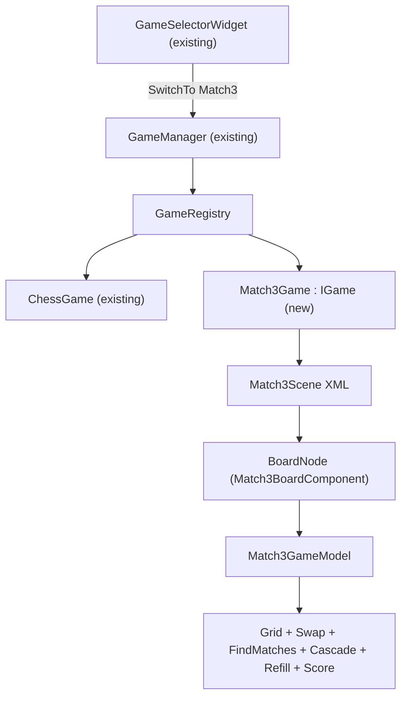

# Match3 MVP

Добавляем `Match3Game` как вторую конкретную реализацию `IGame` поверх уже готовой Games-инфраструктуры (см. [chess-mvp-module](.cursor/plans/chess-mvp-module_5d6e2126.plan.md)). Никаких правок в `src/Modules/Games`, `GameManager`, `GameSelectorWidget`, `SceneManager::SetActiveScene` не делаем — всё это уже заложено chess-планом.

## Архитектура



Слои:
- **Логика** — чистый `Match3GameModel`, без зависимостей от сцены/SDL/ImGui.
- **Сцена** — один `Match3BoardComponent`, который и рисует доску, и ловит мышь (per-gem нод не делаем — гемы динамически появляются/исчезают, отдельные сцен-ноды только усложнят).
- **Игра** — `Match3Game : IGame` авторегистрируется через `REGISTER_GAME`.

## Правила MVP (Bejeweled)

- Сетка 8×8, 6 типов гемов (`CORE_ENUM GemType { None, Red, Orange, Yellow, Green, Blue, Purple }`).
- Стартовая раскладка случайна, **без преcуществующих матчей** (при генерации каждой клетки повторно выбираем тип, если он совпадает с двумя слева или двумя сверху).
- Клик по гему → выделение. Клик по соседнему (Manhattan == 1) → swap.
  - Если после swap есть матч 3+ → начинается резолв (см. ниже).
  - Если матча нет → swap откатывается, выделение снимается.
- Клик по несоседнему → меняем выделение на новый.
- Резолв (синхронно, без анимаций):
  1. `FindMatches` находит все горизонтальные и вертикальные группы 3+ одинаковых гемов.
  2. Все клетки из матчей удаляются (`= GemType::None`); счёт `+1` за каждый удалённый гем (или `+matchLen * 10`, см. поле в модели).
  3. Гравитация: для каждой колонки гемы падают вниз, заполняя `None` снизу.
  4. Доспавн: пустые верхние клетки заполняются случайными `GemType` (без проверки на матч — пускай каскадит).
  5. Снова `FindMatches` — если есть, повторяем 2–4 (каскад). Останавливаемся при стабилизации.

## 1. Модуль `src/Modules/Match3`

Структура (по образцу [src/Modules/Events/CMakeLists.txt](src/Modules/Events/CMakeLists.txt) и `src/Modules/Chess` из chess-плана):

- `src/Modules/Match3/CMakeLists.txt` — `add_library(Match3Module STATIC ...)`, `target_precompile_headers(... REUSE_FROM BECoreModule)`, force-include `BECore/pch.h`, public include `${PROJECT_ROOT}/src/Modules/Match3/src`, линк `BECoreModule + EventsModule + GamesModule`. В конце — `add_reflection_target(Match3Module)`.
- Чистая логика (без зависимостей от сцены):
  - `src/Modules/Match3/src/Match3/Game/Match3Types.h`:
    - `CORE_ENUM(GemType, uint8_t, None, Red, Orange, Yellow, Green, Blue, Purple)`.
    - `struct Cell { int8_t col; int8_t row; };`
    - `static constexpr int8_t kBoardSize = 8;`
    - `static constexpr int8_t kGemTypeCount = 6;` (без `None`).
  - `src/Modules/Match3/src/Match3/Game/Match3Board.h/.cpp` — `GemType _cells[64]`, `Get/Set(col,row)`, `IsInside(Cell)`, `Swap(Cell a, Cell b)`, `eastl::vector<Cell> AllCells() const`. Без правил, чистое хранилище.
  - `src/Modules/Match3/src/Match3/Game/MatchFinder.h/.cpp` — `eastl::vector<Cell> FindMatches(const Match3Board&)`: проходит по строкам и колонкам, собирает прогоны 3+, складывает уникальные клетки (через `eastl::hash_set` или сортировку+`unique`).
  - `src/Modules/Match3/src/Match3/Game/Match3GameModel.h/.cpp`:
    - Поля: `Match3Board _board`, `eastl::optional<Cell> _selected`, `int _score = 0`, `eastl::default_random_engine _rng`.
    - `void Reset(uint32_t seed = 0)` — заполняет доску `GenerateInitialBoard()` (без матчей), обнуляет счёт/выделение.
    - `bool TrySwap(Cell a, Cell b)` — если `IsAdjacent(a,b)`: swap → `FindMatches`. Если есть матчи → `ResolveCascade()` и `return true`. Иначе откатить swap и `return false`.
    - `void OnCellClicked(Cell c)` — реализует логику кликов (выделение/swap/смена выделения).
    - `int GetScore() const`, `eastl::optional<Cell> GetSelected() const`, `GemType GetCellAt(Cell) const`.
    - Приватно: `bool IsAdjacent(Cell, Cell) const`, `void ResolveCascade()` (loop: remove → gravity → refill → find → repeat), `GemType RandomGem()`, `void GenerateInitialBoard()`.
- Игра-обёртка:
  - `src/Modules/Match3/src/Match3/Match3Game.h/.cpp` — `class Match3Game : public IGame`:
    - `GetName() = "Match3"_intern`, `GetSceneName() = "Match3Scene"_intern`.
    - `Start()` — забирает `Match3BoardComponent` из активной сцены, дёргает `Reset()` модели.
    - `Stop()` / `Reset()` — по образцу `ChessGame`.
  - В `.cpp` внизу: `REGISTER_GAME(Match3Game)`.

## 2. Сценочный компонент `Match3BoardComponent`

`src/Modules/Match3/src/Match3/Components/Match3BoardComponent.h/.cpp` — `BE_CLASS(Match3BoardComponent)`, наследник `IComponent` по образцу [QuadRendererComponent](src/Modules/BECore/Scene/Components/QuadRendererComponent.h) и [ClickableComponent](src/Modules/BECore/Scene/Components/ClickableComponent.h):

- `BE_REFLECT_FIELD float _originX = 100.0f;`
- `BE_REFLECT_FIELD float _originY = 100.0f;`
- `BE_REFLECT_FIELD float _cellSize = 64.0f;`
- `BE_REFLECT_FIELD uint32_t _seed = 0;` (передаётся в `Reset(seed)`).
- Внутри — `Match3GameModel _model;` (компонент **владеет** моделью; `Match3Game::Start()` находит компонент через `SceneManager::GetActiveScene()` и зовёт `_model.Reset(_seed)` через геттер).
- `OnAttached()`:
  - Подписка на `SceneEvents::SceneDrawEvent` → `OnDraw`.
  - Подписка на `SDLEvents::MouseButtonDownEvent` ([src/Modules/SDL/src/CoreSDL/SDLEvents.h](src/Modules/SDL/src/CoreSDL/SDLEvents.h)) → `OnMouseDown`. Хранить через `SubscriptionHolder`.
- `OnDraw`:
  - Рисует 64 клетки фона (тёмно-серый/светло-серый шахматный паттерн).
  - Рисует гем каждой непустой клетки как залитый прямоугольник цветом по `GemType` (палитра в `.cpp`).
  - Подсвечивает `_model.GetSelected()` рамкой (например, белый прямоугольник).
  - Использовать тот же подход к рисованию, что и [QuadRendererComponent.cpp](src/Modules/BECore/Scene/Components/QuadRendererComponent.cpp) (через `Renderer` из `CoreManager`).
- `OnMouseDown`:
  - Перевести экранные координаты в `Cell` (`(x - _originX) / _cellSize`).
  - Если внутри доски → `_model.OnCellClicked(cell)`.

Без `Match3GemComponent` и без per-gem нод — гемы рисуются и обрабатываются единым компонентом доски. Это проще для динамического каскада.

## 3. Игра + конфиги

- `src/Modules/Match3/src/Match3/Match3Game.cpp` — `REGISTER_GAME(Match3Game)`.
- В [CmakeLists.txt](CmakeLists.txt):
  - Добавить `add_subdirectory(src/Modules/Match3)` после `add_subdirectory(src/Modules/Chess)` (строка 336).
  - В `target_link_libraries(MyGame PRIVATE ...)` (строки 380–385) добавить `$<LINK_LIBRARY:WHOLE_ARCHIVE,Match3Module>` (вместе с `GamesModule`/`ChessModule`, которые chess-план тоже должен туда добавить — иначе static-init `REGISTER_GAME` отбросится линкером).
- В [CI/meta_generator/reflection_targets.json](CI/meta_generator/reflection_targets.json) добавить запись `"Match3Module"` со своими `source_dirs` (`src/Modules/Match3/src/Match3`), `scan_dirs` (тот же), `include_dirs: ["src/Modules", "src"]`.
- [config/GamesConfig.xml](config/GamesConfig.xml) — оставить `defaultGame="Chess"` без изменений; пользователь сам переключится через `GameSelectorWidget`. (Если хочется стартовать с Match-3, это уже одна правка строки в xml — не часть плана.)

## 4. Сцена и ассеты

- В [config/SceneConfig.xml](config/SceneConfig.xml) добавить рядом с `MainScene`:

```xml
<scene type="Scene" name="Match3Scene">
  <nodes>
    <node name="Board">
      <components>
        <component type="TransformComponent" x="0" y="0" width="0" height="0"/>
        <component type="Match3BoardComponent" originX="100" originY="80" cellSize="64" seed="1337"/>
      </components>
    </node>
  </nodes>
</scene>
```

- Ассеты: для MVP **не нужны** — гемы рисуются цветными прямоугольниками. Палитра задаётся прямо в `Match3BoardComponent.cpp` (`Color` per `GemType`). [config/TextureLibrary.xml](config/TextureLibrary.xml) трогать не надо.

## 5. (Опционально) HUD счёта

Минимальный вариант — без отдельного виджета: `Match3BoardComponent::OnDraw` добавляет `ImGui::Begin("Match3")` с текстом `Score: N` и кнопкой `Reset` (зовёт `_model.Reset(_seed)`). Если такой подход не любим — выносим в отдельный `Match3HudWidget` в `src/Widgets/Match3Hud/` по образцу [TextureEditorWidget](src/Widgets/TextureEditor/TextureEditorWidget.h) и регистрируем в [config/WidgetsConfig.xml](config/WidgetsConfig.xml). Для MVP предлагаю первый вариант (меньше файлов, ноль реестровой суеты).

## 6. Тесты

`src/Modules/Match3/src/Match3/Tests/Match3GameModelTest.h/.cpp` в стиле [src/Modules/BECore/Tests](src/Modules/BECore/Tests). Кейсы:

- `InitialBoardHasNoMatches` — после `Reset(seed=42)` `MatchFinder::FindMatches(board).empty()`.
- `FindMatchesDetectsHorizontalThree` — вручную выставить `R R R` в строке → `FindMatches` вернул 3 клетки.
- `FindMatchesDetectsVerticalThree` — аналогично по колонке.
- `FindMatchesDetectsLShape` — две пересекающиеся тройки (5 уникальных клеток).
- `TrySwapAcceptsMatchingSwap` — заранее разместить `R G R` в строке и `G` сверху над центральной → swap нижнего центрального вверх создаёт `R R R` → `TrySwap` вернул `true`, счёт > 0.
- `TrySwapRevertsNonMatchingSwap` — swap двух соседних, не дающий матча → `TrySwap` вернул `false`, доска идентична исходной, счёт = 0.
- `CascadeIncreasesScore` — сконструировать ситуацию, где удаление первой тройки роняет гемы, образующие вторую тройку → `_score >= matchedGems(t1) + matchedGems(t2)`.

Тесты используют **детерминированный seed** и прямой доступ к доске (через `friend class` или `Match3GameModel::SetCellForTest`). В MVP ок добавить `#ifdef ENGINE_ENABLE_ASSERTS` `SetCellForTest` или просто публичный setter — это не продакшен-API.

Регистрация в [config/TestsConfig.xml](config/TestsConfig.xml):

```xml
<test type="Match3GameModelTest" enabled="true"/>
```

`TestManager` сканирует `BE_CLASS(... ITest ...)` через reflection — сам тест регистрируется в `Match3Module` reflection target, отдельной проводки в C++ не нужно (см. как сделано для [PoolStringTest](src/Modules/BECore/Tests/PoolStringTest.h) и т.п.).

## 7. Порядок зависимостей и сборки

```
BECore -> Math -> Events -> TaskSystem -> SDL -> Games -> Chess -> Match3 -> Application(MyGame)
```

`Match3Module` линкуется в `MyGame` через `WHOLE_ARCHIVE` рядом с `ChessModule` — иначе static-init `REGISTER_GAME(Match3Game)` будет выкинут линкером и игра не появится в `GameSelectorWidget`.

## 8. Важные детали (по правилам проекта)

- Все идентификаторы — `PoolString` + литералы `"..."_intern` (см. [.cursorrules](.cursorrules)).
- Все коллекции — EASTL (`eastl::vector`, `eastl::optional`, `eastl::hash_set`).
- Для рандома — `eastl::default_random_engine` (или `std::mt19937` если EASTL не предоставляет — без `<random>` в заголовках, унести в `.cpp`).
- Никаких `enum class` — `CORE_ENUM`.
- Никаких сырых `new`/`delete`. `Match3Game` — `RefCounted` + `IntrusivePtr` через `BE_CLASS(..., FACTORY_BASE)` как `IGame`.
- `ASSERT(IsInside(c))` в геттерах/сеттерах доски; `std::expected` нигде не нужен — всё локально.
- `Match3BoardComponent::OnAttached` использует `SubscriptionHolder` для RAII-отписки.

## 9. После изменений

- **Formatting:** прогнать clang-format на изменённых файлах (skill `clang-format`, scope = changed).
- **Includes:** прогнать `strip-pch-includes` по новому модулю (skill `strip-pch-includes`), сначала dry-run по `src/Modules/Match3`.
- Сборка: `cmake -B build -G Ninja && cmake --build build`. Проверить:
  - `GameSelectorWidget` показывает теперь две игры: `Chess` и `Match3`.
  - Переключение `Switch -> Match3` активирует `Match3Scene`, на экране 8×8 разноцветных гемов без матчей.
  - Клик по гему подсвечивает его; клик по соседнему создающему матч — гемы пропадают, верхние падают, сверху досыпаются новые, счёт растёт; могут случаться каскады.
  - Клик по соседнему НЕ создающему матч — выделение снимается, доска без изменений.
  - `Reset` (через ImGui-кнопку или повторный `SwitchTo`) перезапускает партию с тем же seed → детерминированная стартовая раскладка.
  - Все `Match3GameModelTest` зелёные на старте `MyGame`.