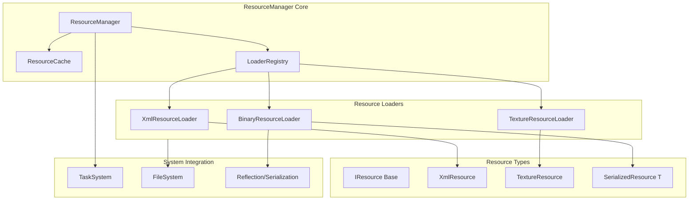

# ResourceManager Implementation Plan

## Architecture Overview



## Core Components

### 1. IResource Base Class

File: [`src/Modules/BECore/Resource/IResource.h`](src/Modules/BECore/Resource/IResource.h)

```cpp
// Use CORE_ENUM macro (NOT enum class)
CORE_ENUM(ResourceState, uint8_t, Unloaded, Loading, Loaded, Failed);

/**
 * @brief Base interface for all managed resources
 * 
 * All resource types inherit from IResource and are managed
 * by ResourceManager with reference counting.
 */
class IResource : public RefCounted {
    BE_CLASS(IResource, FACTORY_BASE)
public:
    virtual ~IResource() = default;
    
    /**
     * @brief Get current loading state
     * @return ResourceState enum value
     */
    virtual ResourceState GetState() const = 0;
    
    /**
     * @brief Get virtual path to this resource
     * @return PoolString with the resource path
     */
    virtual PoolString GetPath() const = 0;
    
    /**
     * @brief Get estimated memory usage in bytes
     * @return Memory usage of this resource
     */
    virtual uint64_t GetMemoryUsage() const = 0;
    
    /**
     * @brief Get human-readable type name
     * @return PoolString with type name (e.g., "XmlResource")
     */
    virtual PoolString GetTypeName() const = 0;
};
```

### 2. ResourceHandle<T>

File: [`src/Modules/BECore/Resource/ResourceHandle.h`](src/Modules/BECore/Resource/ResourceHandle.h)

```cpp
/**
 * @brief Typed handle to a cached resource
 * 
 * Thin wrapper around IntrusivePtr<T> that tracks last access time
 * for potential future LRU eviction support.
 * 
 * @tparam T Resource type (must inherit from IResource)
 * 
 * @example
 * ResourceHandle<XmlResource> handle = resourceManager.Load<XmlResource>("config.xml");
 * if (handle) {
 *     auto node = handle->GetRoot();
 * }
 */
template<typename T>
    requires std::derived_from<T, IResource>
class ResourceHandle {
public:
    // Implicit conversion to bool for validity checks
    explicit operator bool() const noexcept;
    
    // Access operators
    T* operator->() const noexcept;
    T& operator*() const noexcept;
    
    // Get underlying pointer
    T* Get() const noexcept;
    IntrusivePtr<T> GetPtr() const noexcept;
    
private:
    IntrusivePtr<T> _resource;
    mutable std::chrono::steady_clock::time_point _lastAccess;
};
```

### 3. ResourceCache

File: [`src/Modules/BECore/Resource/ResourceCache.h`](src/Modules/BECore/Resource/ResourceCache.h)

```cpp
/**
 * @brief Thread-safe cache for loaded resources
 * 
 * Stores resources by virtual path with reference counting.
 * Uses shared_mutex for read-heavy concurrent access.
 * 
 * @note Eviction is not implemented in v1. Resources stay cached
 * until explicitly cleared or application shutdown.
 */
class ResourceCache {
public:
    /**
     * @brief Get cached resource by path
     * @param path Virtual path to the resource
     * @return Resource pointer or nullptr if not cached
     */
    IntrusivePtr<IResource> Get(PoolString path) const;
    
    /**
     * @brief Store resource in cache
     * @param path Virtual path as cache key
     * @param resource Resource to cache
     */
    void Put(PoolString path, IntrusivePtr<IResource> resource);
    
    /**
     * @brief Check if resource is cached
     * @param path Virtual path to check
     * @return true if resource exists in cache
     */
    bool Contains(PoolString path) const;
    
    /**
     * @brief Clear all cached resources
     */
    void Clear();
    
    /**
     * @brief Get total memory usage of cached resources
     * @return Sum of GetMemoryUsage() for all cached resources
     */
    uint64_t GetTotalMemoryUsage() const;
    
    /**
     * @brief Get number of cached resources
     * @return Cache entry count
     */
    size_t GetCount() const;

private:
    mutable std::shared_mutex _mutex;
    UnorderedPoolMap<IntrusivePtr<IResource>> _cache;
};
```

### 4. IResourceLoader Interface

File: [`src/Modules/BECore/Resource/IResourceLoader.h`](src/Modules/BECore/Resource/IResourceLoader.h)

```cpp
/**
 * @brief Base interface for resource loaders
 * 
 * Each loader handles specific file types and creates
 * corresponding resource objects.
 * 
 * @note Loaders are registered with ResourceManager and
 * selected based on file extension.
 */
class IResourceLoader : public RefCounted {
    BE_CLASS(IResourceLoader, FACTORY_BASE)
public:
    virtual ~IResourceLoader() = default;
    
    /**
     * @brief Check if this loader can handle given extension
     * @param extension File extension (e.g., ".xml", ".png")
     * @return true if this loader supports the extension
     */
    virtual bool CanLoad(eastl::string_view extension) const = 0;
    
    /**
     * @brief Load resource asynchronously
     * @param path Virtual path to the resource
     * @return Task that resolves to loaded resource
     */
    virtual Task<IntrusivePtr<IResource>> LoadAsync(PoolString path) = 0;
    
    /**
     * @brief Load resource synchronously (blocking)
     * @param path Virtual path to the resource
     * @return Loaded resource or nullptr on failure
     */
    virtual IntrusivePtr<IResource> LoadSync(PoolString path) = 0;
};
```

### 5. ResourceManager

File: [`src/Modules/BECore/Resource/ResourceManager.h`](src/Modules/BECore/Resource/ResourceManager.h)

```cpp
/**
 * @brief Central manager for loading and caching resources
 * 
 * Provides async and sync resource loading with automatic caching.
 * Supports multiple resource types through registered loaders.
 * 
 * @note Access via CoreManager::GetResourceManager()
 * 
 * @example
 * // Async loading
 * Task<void> LoadAssets() {
 *     auto xml = co_await CoreManager::GetResourceManager()
 *         .LoadAsync<XmlResource>("config/game.xml");
 *     // Use xml...
 * }
 * 
 * // Sync loading
 * auto xml = CoreManager::GetResourceManager()
 *     .Load<XmlResource>("config/game.xml");
 */
class ResourceManager {
public:
    ResourceManager() = default;
    ~ResourceManager() = default;
    
    /**
     * @brief Initialize resource manager and register default loaders
     */
    void Initialize();
    
    /**
     * @brief Load resource asynchronously with Task<T>
     * @tparam T Resource type (must inherit from IResource)
     * @param path Virtual path to the resource
     * @return Task that resolves to ResourceHandle<T>
     */
    template<typename T>
        requires std::derived_from<T, IResource>
    Task<ResourceHandle<T>> LoadAsync(PoolString path);
    
    /**
     * @brief Load resource synchronously (blocking)
     * @tparam T Resource type (must inherit from IResource)
     * @param path Virtual path to the resource
     * @return ResourceHandle<T> (may be empty on failure)
     */
    template<typename T>
        requires std::derived_from<T, IResource>
    ResourceHandle<T> Load(PoolString path);
    
    /**
     * @brief Load and deserialize object via Reflection system
     * @tparam T Type with BE_CLASS and BE_REFLECT_FIELD
     * @param path Virtual path to XML/binary file
     * @return Task that resolves to deserialized object
     */
    template<HasReflection T>
    Task<T> LoadSerializedAsync(PoolString path);
    
    /**
     * @brief Load and deserialize object synchronously
     * @tparam T Type with BE_CLASS and BE_REFLECT_FIELD
     * @param path Virtual path to XML/binary file
     * @return Deserialized object (default-constructed on failure)
     */
    template<HasReflection T>
    T LoadSerialized(PoolString path);
    
    /**
     * @brief Register a resource loader
     * @param loader Loader instance to register
     */
    void RegisterLoader(IntrusivePtr<IResourceLoader> loader);
    
    /**
     * @brief Clear all cached resources
     */
    void ClearCache();
    
    /**
     * @brief Get cache statistics
     * @return Reference to internal cache for inspection
     */
    const ResourceCache& GetCache() const;

private:
    ResourceCache _cache;
    eastl::vector<IntrusivePtr<IResourceLoader>> _loaders;
    
    IResourceLoader* FindLoader(eastl::string_view extension) const;
};
```

## Resource Types

### XmlResource

File: [`src/Modules/BECore/Resource/XmlResource.h`](src/Modules/BECore/Resource/XmlResource.h)

```cpp
/**
 * @brief XML configuration file as a managed resource
 * 
 * Wraps XmlConfig for caching through ResourceManager.
 * Provides access to root XmlNode for reading configuration.
 * 
 * @example
 * auto handle = resourceManager.Load<XmlResource>("config/game.xml");
 * if (handle) {
 *     auto root = handle->GetRoot();
 *     auto title = root.ParseAttribute<eastl::string_view>("title");
 * }
 */
class XmlResource : public IResource {
    BE_CLASS(XmlResource)
public:
    // IResource interface
    ResourceState GetState() const override;
    PoolString GetPath() const override;
    uint64_t GetMemoryUsage() const override;
    PoolString GetTypeName() const override;
    
    /**
     * @brief Get root XML node for reading
     * @return Root XmlNode of the document
     */
    XmlNode GetRoot() const;
    
    /**
     * @brief Get underlying XmlConfig
     * @return Reference to internal XmlConfig
     */
    const XmlConfig& GetConfig() const;

private:
    friend class XmlResourceLoader;
    
    PoolString _path;
    XmlConfig _config;
    ResourceState _state = ResourceState::Unloaded;
};
```

### SerializedResource<T>

File: [`src/Modules/BECore/Resource/SerializedResource.h`](src/Modules/BECore/Resource/SerializedResource.h)

```cpp
/**
 * @brief Resource containing a deserialized reflected object
 * 
 * Template resource for any type with BE_CLASS and BE_REFLECT_FIELD.
 * Automatically deserializes from XML or binary archives.
 * 
 * @tparam T Reflected type to deserialize
 * 
 * @example
 * // Assuming Player has BE_CLASS and BE_REFLECT_FIELD
 * auto handle = resourceManager.Load<SerializedResource<Player>>("saves/player.xml");
 * Player& player = handle->Get();
 */
template<HasReflection T>
class SerializedResource : public IResource {
    BE_CLASS(SerializedResource)
public:
    // IResource interface
    ResourceState GetState() const override;
    PoolString GetPath() const override;
    uint64_t GetMemoryUsage() const override;
    PoolString GetTypeName() const override;
    
    /**
     * @brief Get reference to deserialized object
     * @return Reference to contained object
     */
    T& Get();
    const T& Get() const;

private:
    PoolString _path;
    T _data;
    ResourceState _state = ResourceState::Unloaded;
};
```

## Test Implementation

File: [`src/Modules/BECore/Tests/ResourceManagerTest.h`](src/Modules/BECore/Tests/ResourceManagerTest.h)

Following the project's test pattern (see `tests-module.mdc`):

```cpp
/**
 * @brief Tests for ResourceManager functionality
 * 
 * Tests async/sync loading, caching, and serialization integration.
 */
class ResourceManagerTest : public ITest {
    BE_CLASS(ResourceManagerTest)
public:
    /**
     * @brief Run all resource manager tests
     * @return true if all tests pass
     */
    bool Run() override;
    
    /**
     * @brief Compile-time validation tests
     */
    static constexpr void TestCompileTime() {
        // Validate ResourceState enum
        static_assert(EnumUtils<ResourceState>::Count() == 4);
        static_assert(EnumUtils<ResourceState>::ToString(ResourceState::Loaded) == "Loaded");
        
        // Validate ResourceHandle constraints
        static_assert(std::derived_from<XmlResource, IResource>);
        
        // Validate Serializable concept works with resources
        // static_assert(HasReflection<XmlResource>);
    }

private:
    bool TestSyncLoading();
    bool TestAsyncLoading();
    bool TestCaching();
    bool TestSerializedResource();
    bool TestLoaderRegistry();
};

// Validate test interface
static_assert(ValidTest<ResourceManagerTest>);
```

Config: `config/TestsConfig.xml`

```xml
<test type="ResourceManager" enabled="true" />
```

## Integration with CoreManager

File: [`src/Modules/BECore/GameManager/CoreManager.h`](src/Modules/BECore/GameManager/CoreManager.h)

```cpp
// Add to CoreManager class:
static ResourceManager& GetResourceManager() {
    return GetInstance()._resourceManager;
}

private:
    ResourceManager _resourceManager;  // Add as member
```

## File Structure

```
src/Modules/BECore/Resource/
    IResource.h              # Base interface + ResourceState enum
    IResourceLoader.h        # Loader interface
    ResourceHandle.h         # Typed handle template
    ResourceCache.h          # Cache declaration
    ResourceCache.cpp        # Cache implementation
    ResourceManager.h        # Manager declaration
    ResourceManager.cpp      # Manager implementation
    XmlResource.h            # XML resource type
    XmlResource.cpp          # XML resource implementation
    XmlResourceLoader.h      # XML loader
    XmlResourceLoader.cpp    # XML loader implementation
    SerializedResource.h     # Template for reflected types

src/Modules/BECore/Tests/
    ResourceManagerTest.h    # Test implementation

config/
    TestsConfig.xml          # Add ResourceManager test entry
```

## Thread Safety

- `ResourceCache` uses `std::shared_mutex` for read-heavy access
- Loading operations run on TaskSystem thread pool
- Resources are immutable after loading (thread-safe reads)
- Only cache Put() requires exclusive lock