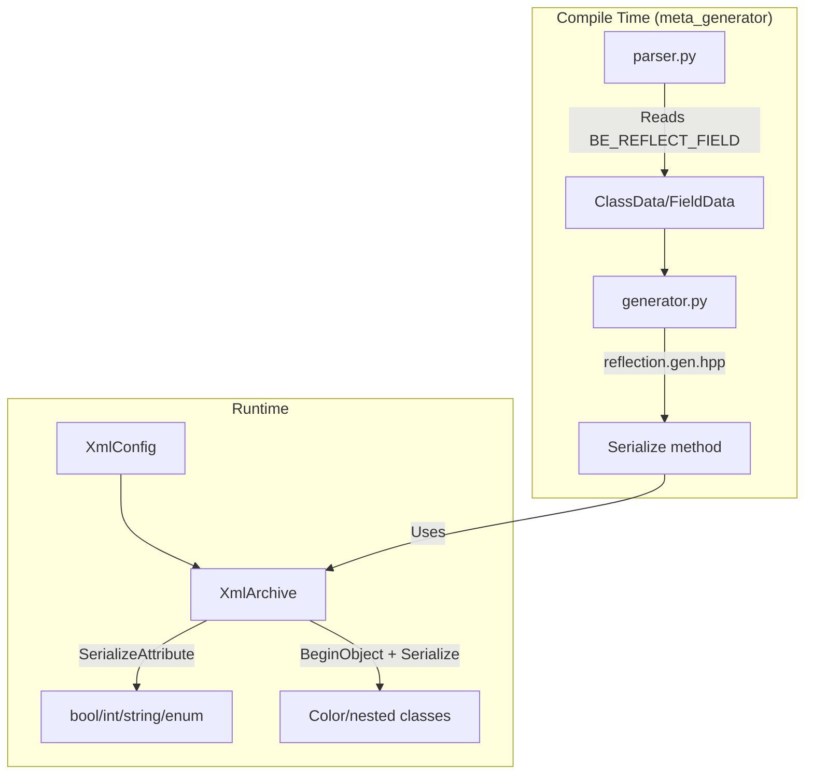

# Refactoring Configuration to XmlArchive Serialization with Reflection

## Overview

Replace manual XML attribute parsing (`XmlNode::ParseAttribute`) with unified reflection-based serialization. Key principles:

1. **Primitives as attributes**: `<sink type="Console" enabled="true" priority="0"/>`
2. **Classes as child elements**: `<Color r="100" g="150" b="200" a="255"/>`
3. **Reflection-driven**: User marks fields with `BE_REFLECT_FIELD`, meta_generator generates `Serialize()`

## Architecture



## Phase 1: XmlArchive Infrastructure

### 1.1 Add attribute serialization

[`src/Modules/BECore/Reflection/IArchive.h`](src/Modules/BECore/Reflection/IArchive.h):

```cpp
// Add attribute variants for primitives
virtual void SerializeAttribute(eastl::string_view name, bool& value) = 0;
virtual void SerializeAttribute(eastl::string_view name, int32_t& value) = 0;
// ... all primitive types
virtual void SerializeAttribute(eastl::string_view name, eastl::string& value) = 0;
```

[`src/Modules/BECore/Reflection/XmlArchive.h`](src/Modules/BECore/Reflection/XmlArchive.h):

- Implement `SerializeAttribute()` methods using XML attributes
- Keep existing `Serialize()` for child elements (nested objects)
- Add `LoadFromXmlConfig(const XmlConfig& config)`
- Add `LoadFromXmlNode(const XmlNode& node)` for sub-node positioning

### 1.2 XML Format Examples

**Primitives as attributes:**

```xml
<sink type="Console" enabled="true" priority="0" minLevel="Debug" colorEnabled="true"/>
```

**Nested class as child element with its own attributes:**

```xml
<widget type="ClearScreen">
    <Color r="100" g="150" b="200" a="255"/>
</widget>
```

## Phase 2: Reflection for Types

### 2.1 Math::Color with reflection

[`src/Modules/Math/src/Math/Color.h`](src/Modules/Math/src/Math/Color.h):

```cpp
struct Color {
    BE_CLASS(Color)
    
    BE_REFLECT_FIELD unsigned char r = 0;
    BE_REFLECT_FIELD unsigned char g = 0;
    BE_REFLECT_FIELD unsigned char b = 0;
    BE_REFLECT_FIELD unsigned char a = 0;
};
```

Generated code will provide automatic serialization.

### 2.2 ConsoleSink with reflection

[`src/Modules/BECore/Logger/ConsoleSink.h`](src/Modules/BECore/Logger/ConsoleSink.h):

```cpp
class ConsoleSink : public ILogSink {
    BE_CLASS(ConsoleSink)
    
    BE_REFLECT_FIELD bool _colorEnabled = true;
    // ...
};
```

## Phase 3: Meta-Generator Extension

### 3.1 Update parser.py

- Already parses `BE_REFLECT_FIELD` markers
- Need to distinguish primitive vs class types for attribute/element decision

### 3.2 Update models.py

Add field type classification:

```python
class FieldData:
    is_primitive: bool  # bool, int, float, string, enum
    is_serializable_class: bool  # Has BE_CLASS
```

### 3.3 Create/update template

[`CI/meta_generator/templates/reflection.gen.hpp.j2`](CI/meta_generator/templates/reflection.gen.hpp.j2):

Add Serialize method generation:

```cpp

template<typename Archive>
void {{ cls.name }}::Serialize(Archive& archive) {


    archive.SerializeAttribute("{{ field.name }}", {{ field.name }});

    if (archive.BeginObject("{{ field.name }}")) {
        ::BECore::Serialize(archive, {{ field.name }});
        archive.EndObject();
    }


}

```

## Phase 4: Interface Changes

### 4.1 ILogSink

[`src/Modules/BECore/Logger/ILogSink.h`](src/Modules/BECore/Logger/ILogSink.h):

```cpp
virtual void Configure(IArchive& archive) {}
```

### 4.2 IWidget

[`src/Modules/BECore/Widgets/IWidget.h`](src/Modules/BECore/Widgets/IWidget.h):

```cpp
virtual bool Initialize(IArchive& archive) = 0;
```

## Phase 5: Manager Updates

### 5.1 LoggerManager

[`src/Modules/BECore/Logger/LoggerManager.cpp`](src/Modules/BECore/Logger/LoggerManager.cpp):

```cpp
XmlArchive archive(XmlArchive::Mode::Read);
archive.LoadFromXmlNode(sinkNode);  // Position at sink node

// Read common attributes
LogSinkType type;
archive.SerializeAttribute("type", type);
bool enabled = true;
archive.SerializeAttribute("enabled", enabled);
// ...

sink->Configure(archive);  // Sink reads its own attributes
```

### 5.2 Similar pattern for:

- WidgetManager
- AssertHandlerManager  
- TestManager
- ApplicationFabric
- SDLMainWindow

## Phase 6: XML Config Updates

Keep current format (attributes for primitives):

**LoggerConfig.xml** - no changes needed:

```xml
<sink type="Console" enabled="true" priority="0" minLevel="Debug" colorEnabled="true"/>
```

**WidgetsConfig.xml** - add nested Color:

```xml
<widget type="ClearScreen">
    <Color r="100" g="150" b="200" a="255"/>
</widget>
```

## Files Summary

| Phase | Files |

|-------|-------|

| XmlArchive | IArchive.h, XmlArchive.h/.cpp |

| Reflection Types | Math/Color.h, ConsoleSink.h, FileSink.h, ClearScreenWidget.h |

| Meta-Generator | parser.py, models.py, generator.py, reflection.gen.hpp.j2 |

| Interfaces | ILogSink.h, IWidget.h |

| Managers | LoggerManager.cpp, WidgetManager.cpp, AssertHandlers.cpp, TestManager.cpp |

| Application | ApplicationFabric.cpp, ApplicationSDLFabric.cpp, SDLMainWindow.cpp |

| Configs | WidgetsConfig.xml (add Color child), others minimal changes |

## Key Design Decisions

1. **SerializeAttribute vs Serialize**: 

   - `SerializeAttribute()` - writes/reads XML attribute
   - `Serialize()` (BeginObject) - writes/reads child element

2. **Type Classification**:

   - Primitives: `bool, int8-64, uint8-64, float, double, string, PoolString, enums`
   - Classes: anything with `BE_CLASS`

3. **Generated Code Location**:

   - `Serialize()` method generated in `.gen.hpp` files
   - Uses existing `ForEachFieldStatic` infrastructure

4. **Backward Compatibility**:

   - XML format stays largely the same (attributes for simple values)
   - Only nested objects become child elements