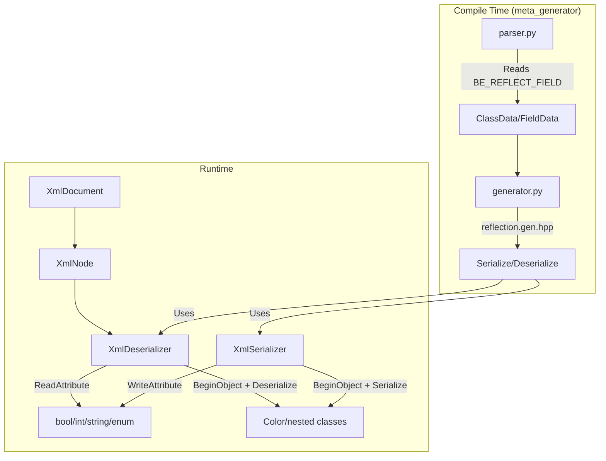

# Refactoring Configuration to Reflection Serialization (Completed)

## Completed outcome (merge ee1e4ef + branch tmp/refactor_serialization)

- **IArchive removed.** Split into:
  - **ISerializer** (Write, WriteAttribute) + **IDeserializer** (Read, ReadAttribute), sharing **IArchiveBase** (BeginObject/EndObject, BeginArray/EndArray).
- **XmlArchive removed.** Replaced by **XmlSerializer** and **XmlDeserializer** (LoadFromFile, LoadFromNode; SaveToFile).
- **Config:** XmlConfigImpl removed; **XmlDocument** holds document lifetime; **XmlNode** is a lightweight wrapper. ConfigManager returns XmlNode, caches `IntrusivePtrAtomic<XmlDocument>`.
- **Math:** Color and NumberUtils moved into BECore (Math module removed as separate module).
- **Assert:** CRTDebugHook (InstallCRTDebugHooks), StackTrace (CaptureAndPrintStackTrace) added; IAssertHandler refactored (RefCountedAtomic, SubscriptionHolder).
- **BinaryArchive/SaveSystem** removed; BinarySerializer/BinaryDeserializer planned (not yet implemented).

---

# Original plan: Refactoring Configuration to XmlArchive Serialization with Reflection

## Overview

Replace manual XML attribute parsing (`XmlNode::ParseAttribute`) with unified reflection-based serialization. Key principles:

1. **Primitives as attributes**: `<sink type="Console" enabled="true" priority="0"/>`
2. **Classes as child elements**: `<Color r="100" g="150" b="200" a="255"/>`
3. **Reflection-driven**: User marks fields with `BE_REFLECT_FIELD`, meta_generator generates `Serialize()`

## Architecture (actual after refactor)



## Phase 1: Serialization infrastructure (original plan; actual: ISerializer/IDeserializer, XmlSerializer/XmlDeserializer)

### 1.1 Add attribute serialization

*(Originally IArchive.h; now ISerializer has WriteAttribute, IDeserializer has ReadAttribute.)*

```cpp
// Add attribute variants for primitives
virtual void SerializeAttribute(eastl::string_view name, bool& value) = 0;
virtual void SerializeAttribute(eastl::string_view name, int32_t& value) = 0;
// ... all primitive types
virtual void SerializeAttribute(eastl::string_view name, eastl::string& value) = 0;
```

*XmlSerializer/XmlDeserializer:*
- `WriteAttribute()` / `ReadAttribute()` for XML attributes
- `BeginObject()` / `EndObject()` + `Serialize()` / `Deserialize()` for child elements
- XmlDeserializer: `LoadFromFile()`, `LoadFromNode(XmlNode)` for sub-node positioning
- XmlSerializer: `SaveToFile()`

### 1.2 XML Format Examples

**Primitives as attributes:**

```xml
<sink type="Console" enabled="true" priority="0" minLevel="Debug" colorEnabled="true"/>
```

**Nested class as child element with its own attributes:**

```xml
<widget type="ClearScreen">
    <Color r="100" g="150" b="200" a="255"/>
</widget>
```

## Phase 2: Reflection for Types

### 2.1 Math::Color with reflection

[`src/Modules/BECore/Math/Color.h`](src/Modules/BECore/Math/Color.h) (Math module moved into BECore):

```cpp
struct Color {
    BE_CLASS(Color)
    
    BE_REFLECT_FIELD unsigned char r = 0;
    BE_REFLECT_FIELD unsigned char g = 0;
    BE_REFLECT_FIELD unsigned char b = 0;
    BE_REFLECT_FIELD unsigned char a = 0;
};
```

Generated code will provide automatic serialization.

### 2.2 ConsoleSink with reflection

[`src/Modules/BECore/Logger/ConsoleSink.h`](src/Modules/BECore/Logger/ConsoleSink.h):

```cpp
class ConsoleSink : public ILogSink {
    BE_CLASS(ConsoleSink)
    
    BE_REFLECT_FIELD bool _colorEnabled = true;
    // ...
};
```

## Phase 3: Meta-Generator Extension

### 3.1 Update parser.py

- Already parses `BE_REFLECT_FIELD` markers
- Need to distinguish primitive vs class types for attribute/element decision

### 3.2 Update models.py

Add field type classification:

```python
class FieldData:
    is_primitive: bool  # bool, int, float, string, enum
    is_serializable_class: bool  # Has BE_CLASS
```

### 3.3 Create/update template

[`CI/meta_generator/templates/reflection.gen.hpp.j2`](CI/meta_generator/templates/reflection.gen.hpp.j2):

Add Serialize method generation:

```cpp

template<typename Archive>
void {{ cls.name }}::Serialize(Archive& archive) {


    archive.SerializeAttribute("{{ field.name }}", {{ field.name }});

    if (archive.BeginObject("{{ field.name }}")) {
        ::BECore::Serialize(archive, {{ field.name }});
        archive.EndObject();
    }


}

```

## Phase 4: Interface Changes

### 4.1 ILogSink

[`src/Modules/BECore/Logger/ILogSink.h`](src/Modules/BECore/Logger/ILogSink.h):

```cpp
virtual void Configure(IDeserializer& deserializer) {}
```

### 4.2 IWidget

[`src/Modules/BECore/Widgets/IWidget.h`](src/Modules/BECore/Widgets/IWidget.h):

```cpp
virtual bool Initialize(IDeserializer& deserializer) = 0;
```

## Phase 5: Manager Updates

### 5.1 LoggerManager

[`src/Modules/BECore/Logger/LoggerManager.cpp`](src/Modules/BECore/Logger/LoggerManager.cpp):

```cpp
XmlDeserializer deserializer;
deserializer.LoadFromNode(sinkNode);  // Position at sink node

// Read common attributes
LogSinkType type;
deserializer.ReadAttribute("type", type);
bool enabled = true;
deserializer.ReadAttribute("enabled", enabled);
// ...

sink->Configure(deserializer);  // Sink reads its own attributes
```

### 5.2 Similar pattern for:

- WidgetManager
- AssertHandlerManager  
- TestManager
- ApplicationFabric
- SDLMainWindow

## Phase 6: XML Config Updates

Keep current format (attributes for primitives):

**LoggerConfig.xml** - no changes needed:

```xml
<sink type="Console" enabled="true" priority="0" minLevel="Debug" colorEnabled="true"/>
```

**WidgetsConfig.xml** - add nested Color:

```xml
<widget type="ClearScreen">
    <Color r="100" g="150" b="200" a="255"/>
</widget>
```

## Files Summary (actual after refactor)

| Phase | Files |
|-------|-------|
| Serialization API | ISerializer.h, IDeserializer.h (IArchiveBase), XmlSerializer.h/.cpp, XmlDeserializer.h/.cpp |
| Config | XmlDocument.h/.cpp, XmlNode.h, XmlConfig.h; ConfigManager uses XmlDocument |
| Reflection Types | BECore/Math/Color.h (moved from Math module), ConsoleSink, FileSink, ClearScreenWidget |
| Meta-Generator | parser.py, models.py, generator.py, reflection.gen.hpp.j2 |
| Interfaces | ILogSink.h, IWidget.h (Configure/Initialize take IDeserializer&) |
| Managers | LoggerManager, WidgetManager, AssertHandlers, TestManager |
| Application | ApplicationFabric, ApplicationSDLFabric, SDLMainWindow |
| Configs | WidgetsConfig.xml (Color child), LoggerConfig.xml, etc. |

## Key Design Decisions

1. **WriteAttribute/ReadAttribute vs BeginObject + Serialize/Deserialize**: 

   - `WriteAttribute()` / `ReadAttribute()` - primitives as XML attributes
   - `BeginObject()` + `Serialize()` / `Deserialize()` - child elements (nested objects)

2. **Type Classification**:

   - Primitives: `bool, int8-64, uint8-64, float, double, string, PoolString, enums`
   - Classes: anything with `BE_CLASS`

3. **Generated Code Location**:

   - `Serialize()` method generated in `.gen.hpp` files
   - Uses existing `ForEachFieldStatic` infrastructure

4. **Backward Compatibility**:

   - XML format stays largely the same (attributes for simple values)
   - Only nested objects become child elements